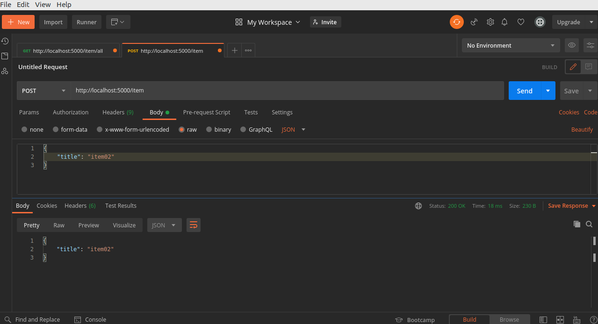
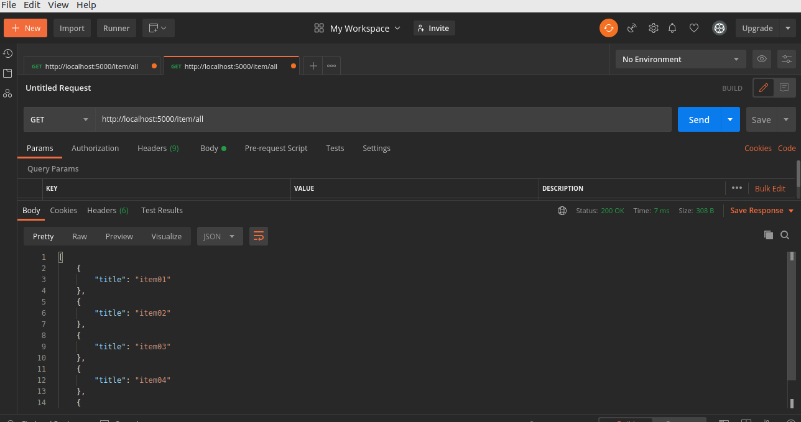
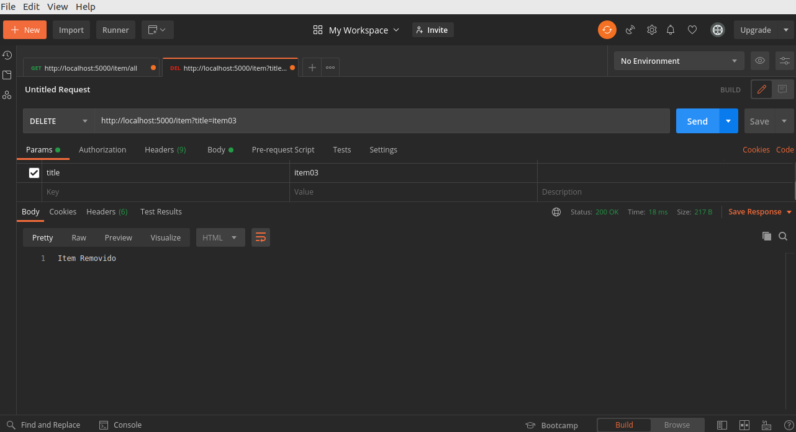
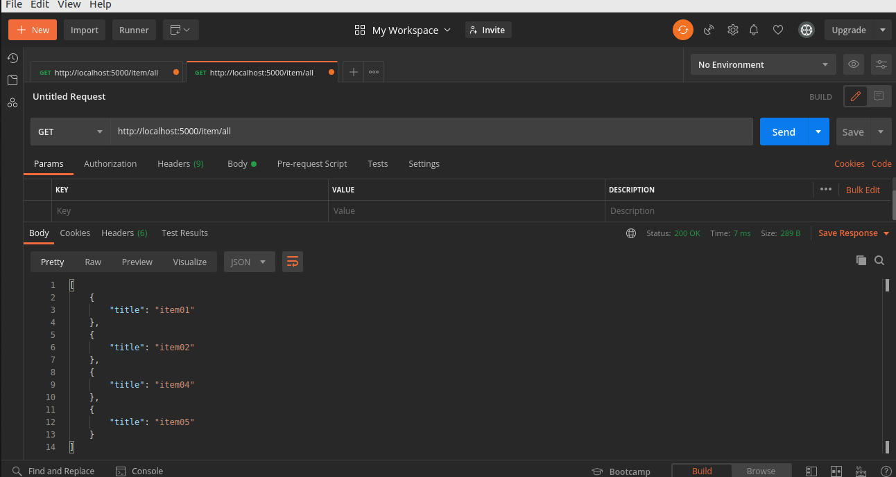

# Aplicação de uma pequena restAPI

Neste módulo o foco será em mostrar uma API simples que mostra o básico do que se pode fazer com o node.

### O que é restAPI?

Uma restAPI é uma arquitetura que acessa vários endpoints \(caminhos de uma URL\) diferentes com vários métodos HTTPs para criar uma aplicação.

### Gerenciadores de requisições

Gerenciadores de requisições são plataformas que  fazem requisições, eles servem para entender como sua aplicação se comporta quando se faz algumas requisições para as funcionalidades da API. 

### Exemplo

A fim deste exemplo, a aplicação que será feita é uma lista encadeada que permite a inserção de novos itens\(ou nós\), e permite também que sejam visualizados ou deletados da lista.

#### Configuração do repositório

Para  começar, iremos criar um repositório e navegar para ele:

```bash
mkdir app
cd app
```

Então preparar o repositório como um repositório node/npm:

```bash
npm init -y
```

 Após isso, iremos instalar o express, que é uma biblioteca que facilita a disponibilização das URLs \(endpoints\) para que o cliente possa usar:

```bash
npm i express
```

Também iremos criar um arquivo em que iremos configurar as funções da API:

```bash
touch index.js
```

Com isso, o seu package.json deve estar:

```javascript
{
  "name": "app",
  "version": "1.0.0",
  "description": "",
  "main": "index.js",
  "scripts": {
    "test": "echo \"Error: no test specified\" && exit 1",
  },
  "keywords": [],
  "author": "",
  "license": "ISC",
  "dependencies": {
    "express": "^4.17.1"
  }
}
```

Iremos instalar mais uma dependência para habilitar o uso da requisição pela api:

```bash
npm i body-parser
```

E iremos colocar um script a mais no package.json, isto irá habilitar que possamos iniciar a aplicação com o seguinte comando:

```bash
npm start
```

Então, no final, o package.json ficará:

```javascript
{
  "name": "app",
  "version": "1.0.0",
  "description": "",
  "main": "index.js",
  "scripts": {
    "test": "echo \"Error: no test specified\" && exit 1",
    "start": "node index.js"
  },
  "keywords": [],
  "author": "",
  "license": "ISC",
  "dependencies": {
    "body-parser": "^1.19.0",
    "express": "^4.17.1"
  }
}
```

#### Codificando a API

Agora, iremos realmente fazer as funcionalidades da api, todas elas irão estar colocadas no arquivo index.js do nosso repositório.

Primeiro, iremos importar todas as dependências que necessitamos para fazer a aplicação e colocar a porta de entrada de nossa aplicação em uma variável:  

```javascript
const express = require('express')
const bodyparser = require('body-parser')
const PORT = 5000
```

Em seguida, vamos criar a função que permita que a porta que queremos acessar para a aplicação e invocar uma constante que guarde a instância do express, para que as funções dessa dependência possam ser utilizadas

```javascript
const app = express()

app.listen(PORT, () => {
    console.log(`Server is active on http://localhost:${PORT}`)
})
```

Caso esteja correto, quando utilizarmos o script para começar a aplicação, o terminal deverá ter a seguinte mensagem:

```bash
Server is active on http://localhost:5000
```

Então iremos fazer uma função que possa inserir itens em uma lista:

```javascript
let list = []

app.post('/item', (req, res) => {

    const { title } = req.body

    const item = {
        "title": title
    }

    list.push(item)

    return res.json(item)

})
```

Iremos fazer duas funções que visualizem a lista; uma delas vê todos os itens da lista e a outra vê somente um item específico da lista:

```javascript
app.get('/item/all', (req, res) => {

    return res.send(list);

})

app.get(`/item`, (req, res) => {

    if(!list.length) return res.status(400).send(`A lista está vazia`)

    const { title } = req.query

    list.map((item) => {
        if(item.title == title) return res.send(item)
    })

    return res.send('Esse item não está na lista')

})
```

E por último, fazer uma função que deleta os itens da lista:

```javascript
app.delete('/item', (req, res) => {


    const { title } = req.query

    let index = -1

    list.map((item) => {
        index++
        if(item.title == title){
            list.splice(index, 1);
            return res.status(200).send('Item Removido')
        }
    })

    return res.status(400).send('Item não encontrado')

})
```

Com todas as funcionalidades feitas, a nossa aplicação simples está bem feita e pode ser utilizada.

#### Testando a aplicação

Iremos utilizar o postman para testar a aplicação e mostrar como que a api reage com as requisições feitas.

Primeiro, iremos iniciar a aplicação:

```bash
npm start
```

E, com a aplicação inicializada, podemos começar a utilizar o postman:

Primeiro, iremos usar o método post na URL [http://localhost:5000/item/](http://localhost:5000/item/), que requer um corpo para fazer a requisição como mostrado na imagem abaixo:



Acima, ns enviamos um corpo em JSON na URL mencionada usando o método POST. Então, como resposta, recebemos um objeto JSON, que mostra o que foi adicionado.

Depois de adicionar mais alguns itens, podemos ver a lista inteira usando o método GET na URL [http://localhost:5000/item/all](http://localhost:5000/item/all), como visto abaixo: 



Se quisermos remover um dos itens, precisamos fazer a requisição DELETE na URL [http://localhost:5000/item/](http://localhost:5000/item/), mas para reconhecer qual item deve ser retirado, precisamos colocar um query string \(reconhecido pelo ? após a URL\). Como nosso identificador dos itens é o parâmetro title, nós colocamos qual item com o title deve ser retirado. Abaixo, mostramos um exemplo:   



E, se vermos, como está a lista atual, vemos que não tem mais o item03:



Com isso, podemos ver todas as requisições, e como elas funcionam e mostrar como nossa API reage a elas.

