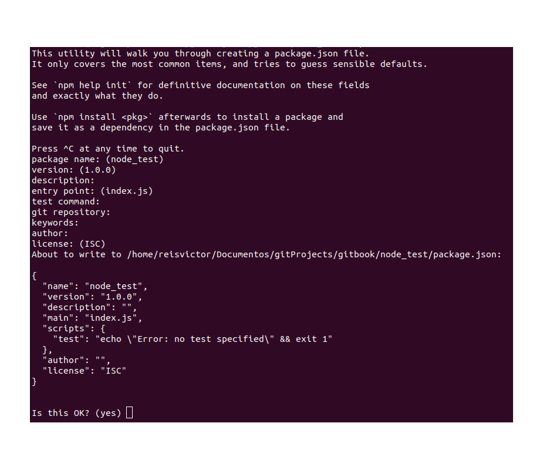
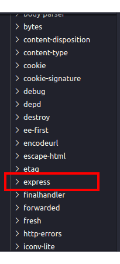

# Utilizando o NPM

### Instalando NPM na sua máquina

O NPM, como mencionado no capítulo anterior, é um gerenciador de pacotes. Seu objetivo é facilitar o uso de algumas bibliotecas e frameworks ligados ao NodeJS.  


Para instalar o NPM, tudo o que precisa fazer \(em linha de comando\) é rodar o seguinte comando:

```text
sudo apt-get install npm

```

Com isso, a instalação irá acontecer devidamente.  


### Inicializando um projeto com NPM

Para inicializar o uso do NPM em uma pasta, terá que fazer:

```text
npm init
```

Logo em seguida, irá pedir que insira algumas informações, mas se deixá-las em branco, como mostrado na imagem abaixo \(só ir apertando a tecla Enter ou inserir -y no comando acima\), o sistema irá deixar a pasta no padrão.  




Dessa forma, o npm irá preparar sua pasta para documentar\(no package.json\) e receber as libraries do ecossistema npm.  


### Arquivo package.json

O arquivo package.json é um arquivo chave do projeto. Nele, você ver várias configurações associadas ao projeto, como o nome do projeto, sua descrição, os scripts de inicialização do projeto, as dependências \(os pacotes instalados no projeto\), a licença utilizada e, principalmente, os autores do projeto.

### Instalando pacotes

Para instalar algum pacote do ecossistema do NPM, a maioria dos pacotes podem ser instalados via o comando:  


```text
npm install <nome_do_pacote>
```

Na imagem a seguir, mostra-se a instalação de um pacote bem conhecido chamado express:


Caso queira instalar algum pacote globalmente, então:

```text
npm install -g <nome_do_pacote>
```

Caso o pacote não siga esse padrão, é só procurar no site npm.org, onde existe uma gama de pacotes disponibilizados.  


Os pacotes instalados vão ser colocadas numa pasta chamada node\_modules:  




Como o package.json é atualizado a cada pacote instalado. Caso a pasta node\_modules não esteja dentro da pasta escolhida para o projeto, só precisa executar:

```text
npm install
```

Que todos os pacotes configurados no package.json serão instalados e a pasta node\_modules será criada.

Para desinstalar algum pacote do repositório npm:

```text
npm uninstall <nome_do_pacote>
```

Com os comandos mostrados, deseja-se ter total controle dos repositórios em que se utiliza as libraries do ecossistema NPM. 

