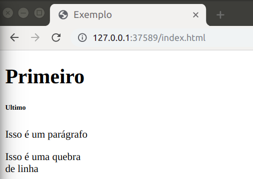

# Formatação

**&lt;h1&gt;&lt;/h1&gt;** — Permite que coloque um titulo no corpo da sua página. O número depois do "h" podem variar de 1 a 6. Quanto menor o número, menor o tamanho da fonte do seu título.

**&lt;p&gt;&lt;/p&gt;**  — Permite que você coloque um parágrafo no corpo da sua página.

**&lt;br&gt;** — Permite colocar uma única quebra de linha. Útil para escrever endereços ou poemas. Essa é uma **tag vazia**, ou seja, ela não tem tag de fechamento. 

#### Exemplo

Abaixo mostramos um exemplo de como essas TAG devem ser escritas. Na aba "Código" está o código, e na aba "Resultado" está a página resultante.



```markup
<!DOCTYPE html>
<html>
<head>
    <title>Exemplo</html>
</head>
<body>
    <h1>Primeiro</h1>
    <h6>Ultimo</h6>
    <p>Isso é um parágrafo</p>
    <p>Isso é uma quebra <br> de linha</p>
</body>
</html>
```







