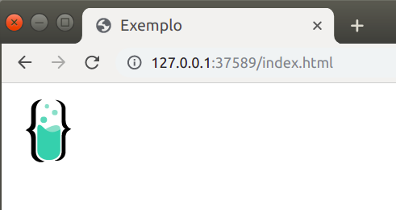

# Multimídia

**&lt;img&gt;** — Essa tag é utiliza para colocar uma imagem na sua página. Essa tag necessita de dois atributos para funcionar corretamente.

* "src" - Indica o caminho \(que pode ser uma URL\) da sua imagem.
* "alt" - Especifica uma descrição para a sua imagem. É muito importante colocar essa descrição por questões de acessibilidade. Os software de leitura automática leem esse texto. Além disso, quando a sua imagem não puder ser exibida por qualquer motivo, será este texto que aparecerá no lugar.

Além disso, você pode utilizar os atributos "width" \(para a largura\) e "height" \(para a altura\) para ajustar as dimensões da sua imagem.

## Exemplo

Abaixo mostramos um exemplo de como essas tags devem ser escritas. Na aba "Código" está o código, e na aba "Resultado" está a página resultante.



```markup
<!DOCTYPE html>
<html>
<head>
    <title>Exemplo</title>
</head>
<body>
    
</body>
</html>
```







