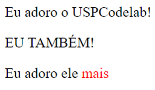

# Organização

**&lt;div&gt;&lt;/div&gt;** — Essa tag define uma seção ou uma divisão em um documento HTML. Ela é utilizada para conter outros elementos do HTML que então podem ser estilizados com CSS ou manipulados com JavaScript.

**&lt;span&gt;&lt;/span&gt;** — Essa tag define uma seção dentro de uma linha do HTML. Ela pode ser facilmente utilizada pelo CSS ou JavaScript, além disso também se pode utilizar o atributo "style".

As duas tags são bem parecidas, porém a &lt;div&gt; é em relação à nível de bloco, e a &lt;spam&gt; é a nível de linha.

## Exemplo

Abaixo mostramos um exemplo de como essas tags devem ser escritas. Na aba "Código" está o código, e na aba "Resultado" está a página resultante.



```markup
<DOCTYPE html>
<html>
<head>
    <title>Exemplo</title>
</head>
<body>
    <div>
        <p>Eu adoro o USPCodelab!</p>
        <p>EU TAMBÉM!</p>
    </div>
    <p>Eu adoro ele <span style="color:red"> mais </span></p>
</body>
</html>
```







