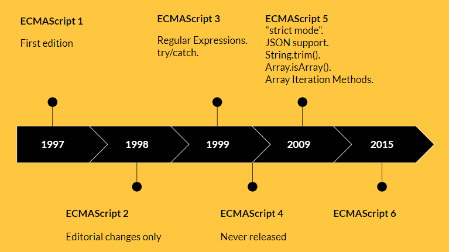

# Introdução ao Javascript - Aprofundado

## O que é Javascript

Uma Linguagem feita originalmente para os browsers, que são **Runtine Environments \(Ambiente de execução\)**. Cada browser possui sua própria **JS Engine \(Ou interpretador javascript\)**. Não pode ter sua estrutura original modificada pois isso quebraria sites legados, mas recebe constantemente atualizações **\(ES6/ECMAscript2015\)** por instituições de padronização **\(ECMA\)**.

## Javascript Engine ou Motor Javascript

A JS engine **interpreta o código .js**. Javascript utiliza **"Just in time compilation"**, que transforma em código de máquina apenas a instrução atualmente utilizada, performando otimização durante a execução. O blog voidcanvas possui um [ótimo artigo](https://www.google.com/url?q=https://www.voidcanvas.com/is-javascript-really-interpreted-or-compiled-language/) sobre o assunto

* Exemplos de JS engines: Chackra\(Edge\) SpiderMonkey\(Firefox\) e **V8\(Google Chrome\)**

## Runtime Environment ou Ambiente de Execução

Acrescentam às engines um **ambiente com scripts, bibliotecas e APIS** úteis ao seu contexto.

* O **browser** implementa um runtime environment para **clientes**, e acrescenta por exemplo funções de **manipulação do DOM/HTML** \(`document.getElementById()`\)
* **Node** é um runtime environment para **servidores**, e acrescenta por exemplo funções de acesso aos **arquivos do sistema** \(`fs.readfile()`\)


Tanto o Google Chrome quanto Node utilizam a mesma JS Engine, o V8.

## ECMA, ES6, ECMAScript2015

Sigla para European Computer Manufacturers Association. **ECMA é uma Instituição de padronização** altamente respeitada que já padronizou outras linguagens como o C\#. Lançam periodicamente novas versões do ECMAScript com **novas funcionalidades** do JS.

Versões demoram para serem implementadas nos browsers. Ferramentas como o **Babel.js transpilam código** de especificação nova para o dito **Vanila.js \(Javascript "Puro"**\).

* A **ECMAScript2015 ou ES6** é a versão que utilizaremos, por ter sido implementada na grande maioria dos browsers sem necessidade de transpilação.




## var vs let vs const

* `var`: **Legado**. Possui escopo da **função na qual foi declarada**, o que pode gerar efeitos colaterais indesejados.

  ```javascript
  function usesVar(){
    var outside_block = 1

    if (outside_block == 1){
        var inside_block = 2
    }

    console.log(inside_block)
  }
  usesVar()
  ```

  A função **funciona e imprime 2**. Na prática, o comportamento é indesejado, pois seria mais **seguro** que unidades declaradas dentro de blocos \(no caso, o **condicional if**\) existissem apenas dentro deles.

* `let`: **ES6: Melhor prática!**. Possui escopo do **bloco, instrução ou expressão** no qual foi declarada.

  ```javascript
  function usesLet(){
      let outside_block = 1

      if (outside_block == 1){
          let inside_block = 2
      }

      console.log(inside_block)
  }

  usesLet()
  ```

  lança o seguinte erro:

  

  Variáveis declaradas com let geram menos efeitos colaterais no código, sendo portanto recomendadas.

* `const`: **ES6: Melhor prática para valores constantes**, pois é imutável¹. Seu escopo é o mesmo de `let`.

  ```text
  let a = 'a'
  const b = 'b'
  a = 'c' // Permite mudança
  b = 'c' // TypeError: Assignment to constant variable
  ```

  ¹ \[Extra\]: const em objetos imutabiliza apenas sua referência e não conteúdo. `Object.freeze` imutabiliza um objeto, mas objetos podem tem outros objetos como atributos, o que só imutabiliza as referências dos objetos da "primeira camada". É necessário aplicar `Object.freeze`recursivamente para criar objetos verdadeiramente imutáveis. Verificar [Este artigo](https://stackoverflow.com/questions/34776846/how-to-freeze-nested-objects-in-javascript)

