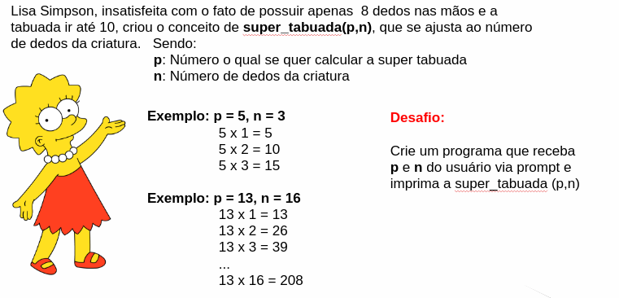

# Laços de Repetição

É recorrente a situação onde se deseja **repetir o mesmo algoritmo** diversas vezes, com determinada **condição de parada** e variações pré-definidas em algumas das variáveis (processo conhecido como **iteração**). Por exemplo, a impressão da tabuada do 7:

```
7x1 = 7
7x2 = 14
7x3 = 21
...
7x10 = 70
```

O cálculo do resultado não é difícil, mas criar um código que realiza a impressão sem uma estrutura de repetição seria trabalhoso: 

```js
let i = 1
console.log("7x1 = ", 7*1)
console.log("7x2 = ", 7*2)
console.log("7x3 = ", 7*3)
// ...
console.log("7x10 = ", 7*10)
```

Mais que isso, a tarefa seria **impossível** caso, ao invés de uma tabuada tradicional, onde são impressos os `n=10` inteiros multiplicados por 7, se desejasse imprimir a **enésima** tabuada do 7. Por exemplo, imprimir de 7x1 a 7x35, com `n=35` definido pelo usuário durante a **execução** do programa.

O problema pode ser facilmente resolvido com a estrutura `for`. 


## for
Define uma iteração a partir de três parâmetros:
- **Condição inicial** das variáveis, executada apenas **uma vez** no início do for.
- **Condição de parada**, testada **a cada iteração**.
- **Atualização** das variáveis de **condição de parada**, executada **a cada iteração**. 

Seu formato é o seguinte:

```js
for(condição inicial, parada, atualização){
    //código a ser repetido
}
```

Por exemplo, imprimir os números de 0 a 100 utilizando um for é simples: 

```js
for(let i = 0; i < 101; i+=1){
    console.log(i)
}
```

A nomenclatura `i` para variáveis numéricas de parada é uma convenção utilizada em muitos livros. 

Para resolver o problema da tabuada, basta quebrá-lo em condição inicial, parada e atualização: 

- Condição inicial: Multiplicando = 0
- Condição de parada: multiplicando < n
- Atualização: multiplicando +=1

```js
let parada = Number(prompt())

for(let multiplicando = 0; multiplicando < parada; multiplicando++){
    let resultado = 7 * i
    console.log("7x" + multiplicando + " = " + resultado)
}
```


